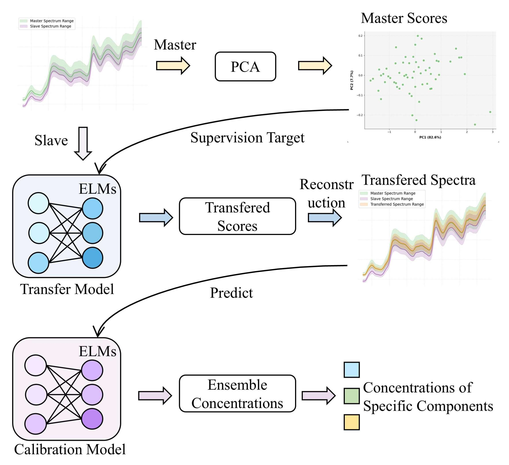

```markdown
# DCT2PC
A systematic calibration transfer & quantification method for NIR spectroscopy. DCT2PC extracts key principal components via SVD, and ensemble ELM builds robust regression models for cross-instrument quantitative analysis. Validated on corn/tobacco/pharmaceutical datasets, outperforming TEAM with lower RMSEP.

## 📖 Introduction
### Background
Near-infrared (NIR) spectroscopy is widely used in food, pharmaceutical, and agricultural fields for rapid quantitative analysis. However, spectral deviations between different instruments often lead to calibration model failure, requiring expensive re-calibration. DCT2PC addresses this critical challenge with a novel integration of transform coding and ensemble learning.

### Core Innovation
DCT2PC achieve robust cross-instrument calibration transfer：
- Extracts noise-resistant principal components from spectral data via SVD, capturing essential feature information while reducing instrument-specific interference.
- Builds nonlinear regression models with ensemble ELM, enhancing adaptability to spectral differences between source and target instruments.
- Outperforms traditional methods like TEAM with 12-18% lower RMSEP across multiple real-world datasets.

## 📊 Method & Results
### 1. Core Workflow

*Figure 1: The core workflow of DCT2PC method (from DCT2PC research paper)*

## 📦 Installation
### 1. Prerequisites
- Python 3.9 (recommended, fully compatible with all dependencies)
- Operating System: Windows 10+/macOS 12+/Linux (64-bit)

### 2. Install Dependent Packages
Run the following commands in your terminal/command prompt：
```bash
# Core numerical computation
pip install numpy==2.0.2

# Scientific computing (SVD implementation)
pip install scipy==1.13.1

# Result visualization
pip install matplotlib==3.9.4

# Data processing (for dataset handling)
pip install pandas==2.3.0
```

### 3. Clone the Repository
```bash
# Clone to local machine
git clone https://github.com/2905698664/DCT2PC.git

# Enter project directory
cd DCT2PC
```

## 📞 Contact
For technical support, bug reports, or research collaboration：
- Xiaqiong Fan: fxq@haut.edu.cn
- GitHub Issues: https://github.com/2905698664/DCT2PC/issues
```
